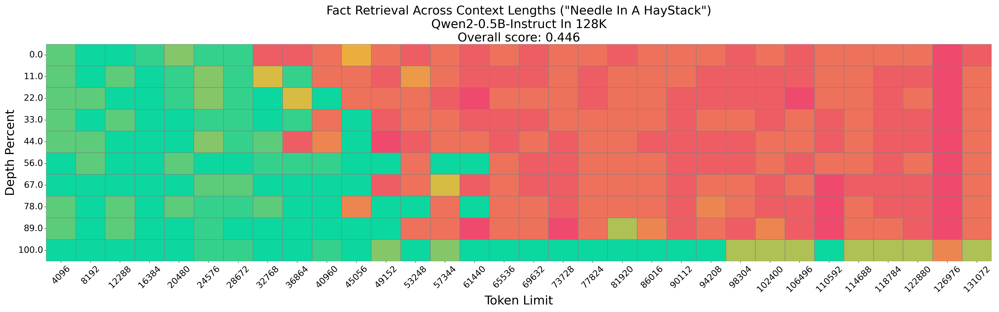
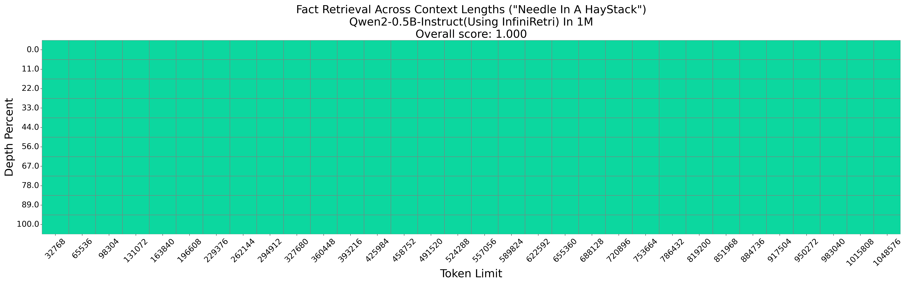

# Infinite Retrieval

## Introduce
Implementation of currently Submitting Paper: "**Infinite Retrieval: Attention Enhanced LLMs in Long Context Processing**", which can apply any Transformer-based LLMs(Large Language Moidels) to handle long-context without training.

Notably，our method **InfiniRretri** can enbale the 0.5B(Qwen2.5-0.5B-Instruct), which originally had a maximum context length of 32K, to Haystack(retrieval) up over 1M tokens on Needle-In-a-Haystack(NIH) test, and even theoretically **infinite-length**.

## How to use

## Presentation

